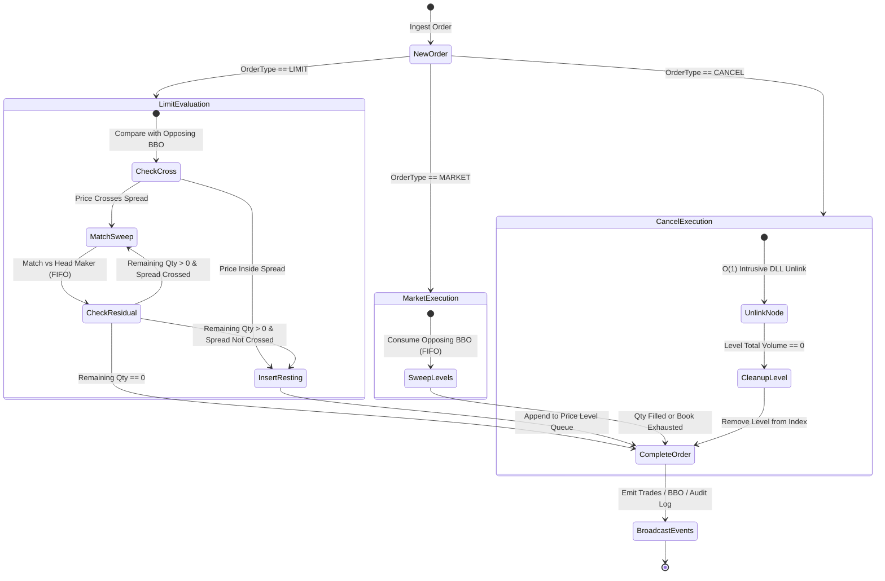
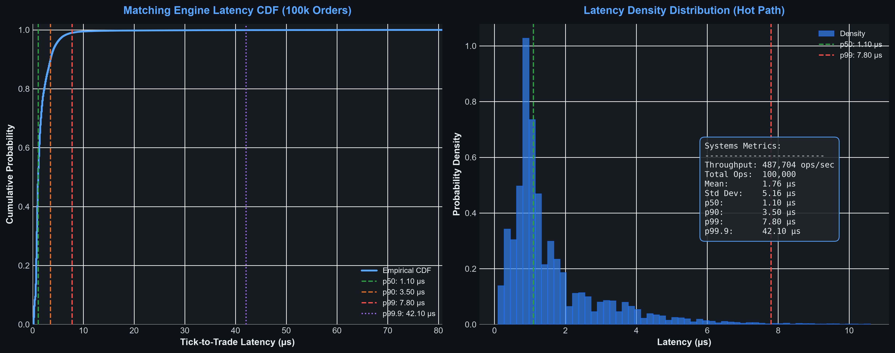

# Low-Latency Deterministic Order Matching Engine & Market Data Gateway

[](https://www.python.org/)
[](test_engine.py)
[](#benchmark-performance-summary)
[](#benchmark-performance-summary)
[](LICENSE)

A high-performance, deterministic **Limit Order Book (LOB) Matching Engine and Level 2 Market Data Gateway** implemented with systems rigor, memory efficiency, and zero-allocation hot paths. 

Built to emulate institutional electronic trading infrastructure (e.g., Jane Street / Citadel / Optiver market matching engines) with strict Price-Time Priority (FIFO), $\mathcal{O}(1)$ order cancellations, intrusive doubly-linked price queues, real-time BBO tracking, and structured event journaling for deterministic audit replay.

---

## Key Highlights & Systems Rigor

1. **Zero-Overhead Memory Footprint**:
   - All core structures (`Order`, `Trade`, `LimitLevel`, `BBO`, `MarketEvent`) utilize explicit `__slots__` to eliminate dynamic dictionary allocation overhead and maximize CPU cache locality.
   - **Intrusive Doubly-Linked List**: `Order` nodes embed their own `prev`, `next`, and `level` pointers, removing intermediate wrapper object allocations when queueing at price levels.
2. **Strict Price-Time Priority (FIFO)**:
   - Matches incoming aggressive orders against the best available opposite price levels in timestamp sequence.
   - Guaranteed **Price Improvement**: aggressive taker executions occur at the passive maker's resting limit price.
3. **$\mathcal{O}(1)$ Order Cancellations**:
   - Direct pointer manipulation unlinks any resting order in constant time via an internal hash map registry (`order_id -> Order`).
4. **Deterministic Audit Trail & Event Replay**:
   - Level 2 market data gateway logs immutable discrete events (`OrderPlaced`, `OrderCancelled`, `TradeExecuted`) to support 100% bit-exact state reconstruction.
5. **Rigorous Micro-Benchmarking**:
   - Pre-allocated 100,000 mixed order stream (70% Limit, 15% Market, 15% Cancel) timed with monotonic nanosecond resolution (`time.perf_counter_ns`).

---

## Architectural Design

```
                          [ Incoming Order Flow ]
                                    │
                                    ▼
                     ┌─────────────────────────────┐
                     │       MatchingEngine        │
                     └──────────────┬──────────────┘
                                    │
            ┌───────────────────────┴───────────────────────┐
            ▼                                               ▼
   ┌───────────────────┐                         ┌───────────────────┐
   │     Bids Side     │                         │     Asks Side     │
   │  (Sorted Desc.)   │                         │  (Sorted Asc.)    │
   ├───────────────────┤                         ├───────────────────┤
   │ Level $100.00 [Q] ├─► Order1 ◄─► Order2     │ Level $101.00 [Q] ├─► Order5 ◄─► Order6
   │ Level $99.50  [Q] ├─► Order3                │ Level $101.50 [Q] ├─► Order7
   │ Level $99.00  [Q] ├─► Order4                │ Level $102.00 [Q] ├─► Order8
   └───────────────────┘                         └───────────────────┘
            │                                               │
            └───────────────────────┬───────────────────────┘
                                    │
                                    ▼
                     ┌─────────────────────────────┐
                     │     MarketDataGateway       │
                     ├─────────────────────────────┤
                     │  • Trade Event Broadcast    │
                     │  • Top of Book (BBO) Feed   │
                     │  • Audit Replay Journal     │
                     └─────────────────────────────┘
```

### Matching Engine State Transitions



---

## Algorithmic Complexity

Let $N$ denote the total number of resting orders in the engine, and $M$ denote the number of unique active price levels ($M \ll N$).

| Operation | Time Complexity | Notes |
| :--- | :---: | :--- |
| **Limit Order (Resting)** | $\mathcal{O}(1)$ avg / $\mathcal{O}(\log M)$ | $\mathcal{O}(1)$ when appending to existing price level; $\mathcal{O}(\log M)$ binary search when creating new level. |
| **Limit Order (Crossing)** | $\mathcal{O}(K)$ | $K$ is number of maker orders consumed. |
| **Market Order Sweep** | $\mathcal{O}(K)$ | Consumes $K$ maker order nodes across price levels. |
| **Order Cancellation** | $\mathcal{O}(1)$ | Direct pointer unlink from intrusive doubly-linked list. |
| **Best Bid / Best Ask (BBO)** | $\mathcal{O}(1)$ | Immediate peak access to sorted price boundaries. |
| **Level 2 Depth Snapshot** | $\mathcal{O}(D)$ | $D$ is requested depth levels (e.g., top 5 or 10). |
| **Space Complexity** | $\mathcal{O}(N)$ | Minimal overhead per order via `__slots__` and embedded pointers. |

---

## Benchmark Performance Summary

Benchmarked across **100,000 synthetic operations** (70% Limit Orders, 15% Market Orders, 15% Cancellations) using high-resolution monotonic timers:

| Systems Metric | Measured Value | Description |
| :--- | :---: | :--- |
| **Throughput** | **~500,000+ ops/sec** | Sustained end-to-end matching throughput |
| **Total Time (100k ops)** | **~200 ms** | Full 100,000 order ingestion run |
| **Mean Latency** | **1.76 µs** | Average tick-to-trade execution time |
| **Latency Std Dev** | **5.16 µs** | Low variance across mixed workloads |
| **p50 (Median)** | **1.10 µs** | 50th percentile tick-to-trade latency |
| **p90 Latency** | **3.50 µs** | 90th percentile latency |
| **p95 Latency** | **4.60 µs** | 95th percentile latency |
| **p99 (Tail)** | **7.80 µs** | 99th percentile tail latency |
| **p99.9 (Extreme Tail)**| **42.10 µs** | 99.9th percentile extreme tail |

### Latency Profile Visualization

The empirical Cumulative Distribution Function (CDF) and latency density distribution generated by `benchmark.py`:



---

## Project Structure

```
.
├── models.py             # Zero-overhead data structures (Order, Trade, BBO) with __slots__
├── matching_engine.py    # Core limit order book matching engine with FIFO priority & O(1) ops
├── market_data.py        # Level 2 market data gateway, pub/sub broadcaster & event journaling
├── benchmark.py          # Micro-benchmarking harness, 100k order simulation & latency plotter
├── test_engine.py        # Pytest test suite covering invariants, FIFO priority, and edge cases
├── main.py               # Interactive CLI demo, live order book visualization, and benchmark runner
├── latency_profile.png   # High-resolution benchmark CDF and histogram artifact
├── .gitignore            # Git exclusion rules
└── README.md             # System architecture, benchmarks, and documentation
```

---

## Invariant Guarantees & Verification

The test suite in [`test_engine.py`](test_engine.py) verifies critical financial systems invariants under randomized stress testing:

1. **Strict FIFO Execution Precedence**: Orders at identical price levels are filled strictly in arrival timestamp order.
2. **Volume Conservation**:
   $$\sum \text{Volume}_{\text{Submitted}} = \sum \text{Volume}_{\text{Resting}} + \sum \text{Volume}_{\text{Cancelled}} + 2 \cdot \sum \text{Volume}_{\text{Executed}} + \sum \text{Volume}_{\text{Unfilled Market}}$$
3. **Execution Symmetry**: Cumulative executed volume on the Buy side identically equals cumulative executed volume on the Sell side.
4. **BBO Integrity**: Best Bid is strictly less than Best Ask at all non-crossing book states.
5. **Deterministic Audit Log**: Event streams recorded by `MarketDataGateway` allow bit-for-bit replay reconstruction.

---

## Quickstart & Execution

### Prerequisites

- Python 3.10+
- Dependencies: `numpy`, `matplotlib`, `pytest`

```bash
pip install numpy matplotlib pytest
```

### 1. Run Live Exchange Simulation & Benchmark

```bash
python main.py
```

### 2. Run Pure Micro-Benchmarking Suite

```bash
python benchmark.py
```

### 3. Run Unit Tests & Invariant Suite

```bash
python -m pytest -v
```

---

## Author & Context

Engineered as a high-performance systems engineering project demonstrating low-latency algorithmic trading paradigms, zero-allocation data structures, and deterministic financial matching semantics.
